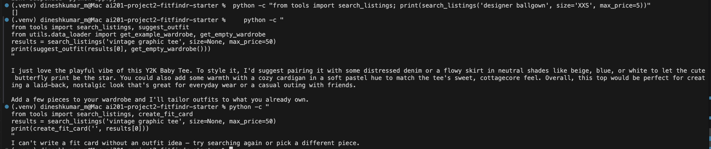
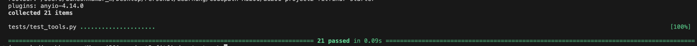

# FitFindr — Starter Kit

This starter kit contains everything you need to begin Project 2.

## What's Included

```
ai201-project2-fitfindr-starter/
├── data/
│   ├── listings.json          # 40 mock secondhand listings
│   └── wardrobe_schema.json   # Wardrobe format + example wardrobe
├── utils/
│   └── data_loader.py         # Helper functions for loading the data
├── tests/
│   └── test_tools.py          # pytest suite for the three tools (21 tests)
├── tools.py                   # The three agent tools: search_listings, suggest_outfit, create_fit_card
├── agent.py                   # Planning loop (run_agent), query parser, session state
├── app.py                     # Gradio UI (handle_query)
├── planning.md                # Your planning template — fill this out first
├── requirements.txt           # Python dependencies
└── README.md                  # This file
```

## Setup

**macOS / Linux:**
```bash
python -m venv .venv
source .venv/bin/activate
pip install -r requirements.txt
```

**Windows:**
```bash
python -m venv .venv
source .venv/Scripts/activate
pip install -r requirements.txt
```

Set your Groq API key in a `.env` file (get a free key at [console.groq.com](https://console.groq.com)):
```
GROQ_API_KEY=your_key_here
```

## The Mock Listings Dataset

`data/listings.json` contains 40 mock secondhand listings across categories (tops, bottoms, outerwear, shoes, accessories) and styles (vintage, y2k, grunge, cottagecore, streetwear, and more).

Each listing has: `id`, `title`, `description`, `category`, `style_tags`, `size`, `condition`, `price`, `colors`, `brand`, and `platform`.

Load it with:
```python
from utils.data_loader import load_listings
listings = load_listings()
```

## The Wardrobe Schema

`data/wardrobe_schema.json` defines the format your agent uses to represent a user's existing wardrobe. It includes:

- `schema`: field definitions for a wardrobe item
- `example_wardrobe`: a sample wardrobe with 10 items you can use for testing
- `empty_wardrobe`: a starting template for a new user

Load an example wardrobe with:
```python
from utils.data_loader import get_example_wardrobe
wardrobe = get_example_wardrobe()
```

## Tool Inventory


The agent uses exactly three tools, all defined in [tools.py](tools.py). Signatures below are representations of the code, not the plan.

### 1. `search_listings` — [tools.py:42](tools.py#L42)

Pure-Python search over the 40-item mock catalog. 

| | |
|---|---|
| **Inputs** | `description: str` (required free-text keywords, e.g. `"vintage graphic tee"`), `size: str \| None = None` (size filter, case-insensitive substring so `"m"` matches `"S/M"`), `max_price: float \| None = None` (inclusive price ceiling) |
| **Output** | `list[dict]` — full listing dicts sorted by relevance score (highest first); `[]` when nothing matches |
| **Purpose** | Load the catalog via `load_listings()`, drop listings over `max_price` and those failing the size substring test, score each survivor by how many distinct description keywords appear in its `title` + `description` + `style_tags`, drop score-0 listings, and return the rest sorted by score descending. |

Each returned listing dict carries: `id` (str), `title` (str), `description` (str), `category` (str — tops/bottoms/outerwear/shoes/accessories), `style_tags` (list[str]), `size` (str), `condition` (str — excellent/good/fair), `price` (float), `colors` (list[str]), `brand` (str | None), `platform` (str — depop/thredUp/poshmark).

### 2. `suggest_outfit` — [tools.py:127](tools.py#L127)

LLM-backed (Groq `llama-3.3-70b-versatile`, `temperature=0.7`).

| | |
|---|---|
| **Inputs** | `new_item: dict` (a single listing dict — the selected top search result; its `title`, `category`, `colors`, `style_tags`, and `price` are read into the prompt), `wardrobe: dict` (a dict with an `items` key holding a list of wardrobe-item dicts; a missing key or empty list is handled as "empty") |
| **Output** | `str` — a non-empty natural-language outfit suggestion. Never empty, never raises. |
| **Purpose** | Build 1–2 outfits around `new_item`. When `wardrobe["items"]` is populated, the prompt lists each owned piece by name and asks the model to reference them directly; when empty, it asks for general styling ideas and appends a fixed "Add a few pieces…" nudge. |

### 3. `create_fit_card` — [tools.py:241](tools.py#L241)

LLM-backed (Groq `llama-3.3-70b-versatile`, `temperature=1.0` for variety).

| | |
|---|---|
| **Inputs** | `outfit: str` (the suggestion string from `suggest_outfit`; guarded for None/empty/whitespace), `new_item: dict` (the selected listing — its `title`, `price`, and `platform` are surfaced in the caption exactly once each) |
| **Output** | `str` — a 2–4 sentence OOTD-style caption. Never empty, never raises. |
| **Purpose** | Turn the outfit and item facts into a casual, shareable social-media caption that names the item, its price, and the platform once each. |

---

## Planning Loop

The planning loop lives in `run_agent()` and is a **fixed, linear pipeline with a single early-exit branch** — the tool order never changes, the only decision point is whether the search returned anything. It does not ask an LLM which tool to call next but rather the control flow is hard-coded because the task has exactly one valid ordering.

Step by step, matching the implementation:

1. **Initialize** — `_new_session(query, wardrobe)` creates a fresh session dict with every output field set to `None`/empty and `error = None`.
2. **Parse** — `_parse_query()` ([agent.py:43](agent.py#L43)) extracts `description`, `size`, and `max_price` with regex/string parsing (no LLM): a dollar amount after `under`/`below`/`$` becomes `max_price`; an explicit `size <token>` phrase or a standalone size token (XS–XXL) becomes `size`; the leftover text, with filler words stripped, becomes `description`. The result is stored in `session["parsed"]`.
3. **Search** — `search_listings(description, size, max_price)` runs and the list is stored in `session["search_results"]`.
   - **Branch A (empty results):** the loop sets `session["error"]` to a message that echoes the parsed filters and `return`s immediately — `suggest_outfit` and `create_fit_card` are never called.
   - **Branch B (non-empty):** `session["selected_item"] = search_results[0]` (the highest-scored match) and execution continues.
4. **Suggest** — `suggest_outfit(selected_item, wardrobe)` runs and its string is stored in `session["outfit_suggestion"]`. The loop does **not** branch on the empty-wardrobe case; the tool handles that internally and always returns a non-empty string.
5. **Caption** — `create_fit_card(outfit_suggestion, selected_item)` runs and its string is stored in `session["fit_card"]`. Again no branch — the tool self-guards a missing outfit.
6. **Return** — `return session`. The caller (`handle_query` in [app.py](app.py)) checks `session["error"]` first; if it's `None`, all three output fields are populated.

**How it knows it's done:** the pipeline has a fixed number of stages, so it terminates either when Branch A fires after the search, or when all three tools have run and `fit_card` is set.

---

## State Management

All state for one interaction lives in a single `session` dict created by `_new_session()` ([agent.py:99](agent.py#L99)) — one source of truth that each stage reads from and writes back to. There is no global state and no persistence between calls: every query starts a brand-new session, and the dict is discarded once `run_agent()` returns.

| Field | Type | Written by | Read by |
|-------|------|-----------|---------|
| `query` | str | `_new_session` | parse step |
| `parsed` | dict (`description`, `size`, `max_price`) | parse step | `search_listings` call |
| `search_results` | list[dict] | `search_listings` | empty-check branch, item selection |
| `selected_item` | dict \| None | item-selection step (`= search_results[0]`) | `suggest_outfit`, `create_fit_card`, UI |
| `wardrobe` | dict | `_new_session` (from caller) | `suggest_outfit` |
| `outfit_suggestion` | str \| None | `suggest_outfit` | `create_fit_card`, UI |
| `fit_card` | str \| None | `create_fit_card` | UI |
| `error` | str \| None | early-exit branch | caller / UI (checked first) |

Concretely, data flows by handoff through these keys: `search_listings` writes `search_results`; the loop copies `search_results[0]` into `selected_item`; `suggest_outfit` reads `selected_item` + `wardrobe` and writes `outfit_suggestion`; `create_fit_card` reads `outfit_suggestion` + `selected_item` and writes `fit_card`. On the early-exit path the loop writes `error` and returns, leaving every downstream field `None` so the UI can tell a real result from a failure.

---

## Interaction Walkthrough

<!-- Walk through a complete interaction step by step: natural language query → each tool call (and why) → final fit card.
     Walk through this carefully — it's how graders follow your agent's reasoning without a live demo.
     Use a specific example — do not leave this as a template. -->

**User query:** `"looking for a vintage graphic tee under $30"` (with the example wardrobe selected). This is the happy-path query from the `agent.py` CLI block, and the tool calls below are the verified sequence it produces.

Before any tool runs, `_parse_query()` turns the query into `parsed = {"description": "vintage graphic tee", "size": None, "max_price": 30.0}` — the `under $30` phrase is pulled out as the price ceiling, no size token is present, and the filler words ("looking for a") are stripped from the description.

**Step 1 — Tool called:**
- Tool: `search_listings`
- Input: `search_listings("vintage graphic tee", size=None, max_price=30.0)`
- Why this tool: the loop always searches first — there is nothing to style or caption until a concrete listing is selected. This is also the only stage that can short-circuit the pipeline.
- Output: a 20-item `list[dict]` sorted by keyword-overlap score. The top hit (verified by running the tool) is `lst_002` *"Y2K Baby Tee — Butterfly Print"* (`price 18.0`, `platform "depop"`, tags include `graphic tee`, `vintage`). Stored in `session["search_results"]`.

**Step 2 — Tool called:**
- Tool: `suggest_outfit`
- Input: `suggest_outfit(selected_item, wardrobe)` where `selected_item = search_results[0]` (the Y2K Baby Tee) and `wardrobe` is the example wardrobe (which includes baggy straight-leg jeans and chunky white sneakers).
- Why this tool: the results list is non-empty, so the loop takes Branch B, copies `search_results[0]` into `session["selected_item"]`, and styles that item against the user's wardrobe.
- Output: a non-empty styling string referencing the user's actual pieces by name, e.g. *"Tuck the Y2K butterfly baby tee into your Baggy straight-leg jeans, throw on a denim jacket, and finish with your Chunky white sneakers for an easy Y2K-streetwear look."* Stored in `session["outfit_suggestion"]`.

**Step 3 — Tool called:**
- Tool: `create_fit_card`
- Input: `create_fit_card(outfit_suggestion, selected_item)` — the Step 2 string plus the Y2K Baby Tee listing.
- Why this tool: with an outfit in hand, the final stage turns it into a shareable caption that names the item, price, and platform.
- Output: a 2–4 sentence caption (higher temperature, so it varies per run) mentioning the title, `$18.00`, and `depop` once each, e.g. *"butterfly-print baby tee summer ✨ thrifted this Y2K gem on depop for $18 and paired it with my baggiest jeans + chunky sneakers. early 2000s but make it now. #thrifted #ootd"*. Stored in `session["fit_card"]`.

**Final output to user:** `handle_query()` sees `session["error"] is None` and fills the three Gradio panels — **🛍️ Top listing found** with the formatted Y2K Baby Tee details (title, $18.00, condition, size, platform "depop", colors, brand), **👗 Outfit idea** with the Step 2 string, and **✨ Your fit card** with the Step 3 caption.

---

## Error Handling and Fail Points

<!-- For each tool, describe the specific failure mode and what your agent does in response.
     This maps to the error handling section of the rubric (F5-C1). -->

| Tool | Failure mode | Agent response |
|------|-------------|----------------|
| `search_listings` | No listing matches the query (also: empty/whitespace description, or `load_listings()` raises) | The tool returns `[]` rather than raising — the loader call and an empty-keyword guard both short-circuit to `[]`. The planning loop detects the empty list, sets `session["error"]` to a message that echoes the parsed filters, and returns **before any LLM tool runs**. The UI shows the message in panel 1; panels 2 and 3 stay empty. |
| `suggest_outfit` | Wardrobe is empty (or has no `items` key); or the Groq call fails / returns blank | The tool never errors or returns empty. An empty/missing wardrobe routes to the general-advice prompt and the response gets a fixed "Add a few pieces…" nudge appended. If the LLM call itself raises or returns blank, a hard-coded neutral fallback string is used. The pipeline continues normally to `create_fit_card`. |
| `create_fit_card` | `outfit` is None/empty/whitespace; or the Groq call fails | A None/empty/whitespace `outfit` returns the guard string *"I can't write a fit card without an outfit idea…"* instead of raising. If the LLM call fails mid-generation, the tool assembles a plain fallback caption from the item's title, price, and platform so the user still gets a shareable result. It never returns an empty string. |

**Concrete examples from testing** (all in [tests/test_tools.py](tests/test_tools.py) — `21 passed`):

- **`search_listings` no-match:** `search_listings("designer ballgown", size="XXS", max_price=5)` returns `[]` (verified live and in `test_search_empty_results`). Driving the same query through the agent — `run_agent("designer ballgown size XXS under $5", ...)` — sets `session["error"]` to *"I couldn't find any 'designer ballgown' under $5 in size XXS right now. Try removing the size or raising your budget…"* and leaves `outfit_suggestion`/`fit_card` as `None`. `test_loader_failure_returns_empty_list` also confirms that when `load_listings()` is patched to raise `OSError`, the tool still returns `[]`.
- **`suggest_outfit` LLM failure:** `test_llm_failure_falls_back_to_non_empty_string` patches `_get_groq_client` to raise `RuntimeError("api down")`; the tool returns a non-empty fallback string instead of propagating the error. `test_empty_wardrobe_does_not_crash_and_is_non_empty` confirms an empty wardrobe yields a non-empty string containing the "Add a few pieces" nudge.
- **`create_fit_card` empty/invalid outfit:** `create_fit_card("", new_item)` returns a string containing *"can't write a fit card"* (`test_empty_outfit_returns_error_message_not_exception`); whitespace-only and `None` inputs hit the same guard (`test_whitespace_outfit_returns_error_message`, `test_non_string_outfit_returns_error_message`). `test_llm_failure_falls_back_with_item_facts` confirms that on an API error the fallback caption still names the item's title, platform, and `38.00` price.


All three failure modes are be triggered deliberately to produce a specific, informative agent response.

---

## Running the Tests

The three tools are covered by a pytest suite in [tests/test_tools.py](tests/test_tools.py). Run it from the project root with the virtualenv active:

```bash
python -m pytest tests/test_tools.py -q
```

Expected output:



The suite covers the happy paths plus every failure mode in the table above — no-match searches, loader failures, empty wardrobes, LLM-call failures, and empty/whitespace/`None` outfit inputs — using monkeypatching to force the LLM-backed tools down their fallback branches without real Groq calls.

---

## Spec Reflection

<!-- Answer both questions with at least 2–3 sentences each. -->

**One way planning.md helped during implementation:** Planning.md helpmed me mainly from its architecture. The architecture was highly efficient and explained how the system worked and what the best way to implement the code was, especially when using claude to implement the code. And most importantly, `run_agent()` would not work without the effectiveness of planning.md since each step had a predetermined place to read its input and store its output which was stated in planning.md. The single-early-exit design me up front that only the search stage needed a branch, so I didn't over-engineer the LLM tools with redundant loop-level checks.

**One divergence from your spec, and why:** planning.md repeatedly describes a "30-item" catalog in the Tool 1 section, but the shipped code searches the **actual 40-item dataset** returned by `load_listings()` (confirmed by `load_listings()` returning `len == 40`). The implementation never hard-codes a catalog size — it iterates whatever the loader returns — so the "30" in the plan was simply a stale number, and the code is correct against the real `data/listings.json`. A second, smaller divergence: the plan described query parsing only in the abstract, but the implementation added an explicit `_SIZE_TOKENS` whitelist and a `_FILLER` stop-word set in `agent.py` so that ordinary words (e.g. "a", "in") are never mistaken for a size and the parsed `description` stays clean — detail the plan didn't anticipate but that was needed to make `_parse_query()` reliable.

---

## AI Usage

I used Claude to accelerate implementation, but treated every output as a draft to verify against `planning.md` and the test suite rather than accepting it wholesale. Two specific instances:

**Instance 1 — Implementing `search_listings` (Milestone 3).**
*Input I gave the AI:* the Tool 1 section of `planning.md` (inputs, return shape, and the "return `[]`, never raise" failure mode), the existing docstring + signature of `search_listings` in `tools.py`, and the field list from `load_listings()` in `utils/data_loader.py`. I explicitly asked for pure-Python keyword-overlap scoring with **no LLM call**.
*What it produced:* a working filter-then-score function — price filter, size filter, keyword counting, sort by score descending.
*What I changed/overrode:* the first version did **case-sensitive** keyword matching and an exact-match size filter, which contradicted the plan's "case-insensitive, `'M'` matches `'S/M'`" requirement. I overrode it to lowercase the haystack and use a case-insensitive **substring** test for size (`size_filter in listing_size`). I also added the empty-keyword guard (`if not keywords: return []`) so a blank/whitespace description returns `[]` rather than scoring every listing — later locked in by `test_empty_description_returns_empty_list`.

**Instance 2 — Implementing the planning loop + early exit (Milestone 4).**
*Input I gave the AI:* the **Planning Loop**, **State Management**, and **Architecture diagram** sections of `planning.md`, plus the `run_agent`/`_new_session` scaffolding in `agent.py`. I asked it to implement the 6-step pipeline writing into the exact session keys named in the State Management table, with the early-exit branch after `search_listings`.
*What it produced:* a `run_agent()` that called the three tools in order and a generic "no results found" error string.
*What I changed/overrode:* the generated error message was generic and didn't reflect the user's filters, which the plan's Error Handling table specifically called for. I rewrote the Branch-A block to assemble the message from `parsed` (echoing the description, `under $N`, and `in size X` only when present) so the user knows exactly which filter to relax. I also moved query parsing into a dedicated `_parse_query()` with the `_SIZE_TOKENS` and `_FILLER` sets rather than the inline string-splitting the AI first suggested, because the naive version mis-parsed filler words as sizes.